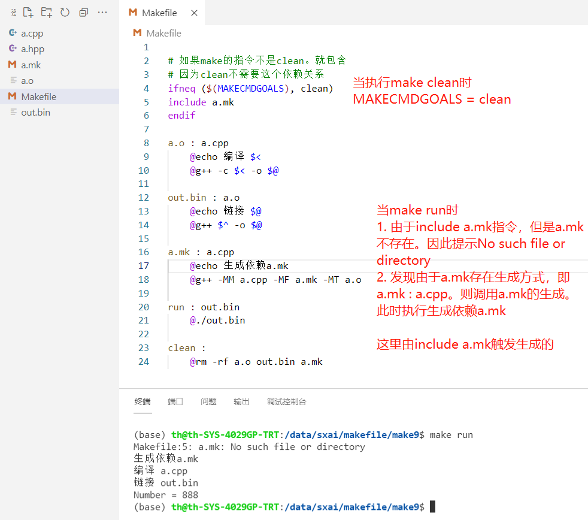

# makefile教程

## makefile执行编译链接流程

* 参考图中红色注释部分，当`make run`时，先明晰调用的顺序，再从最后一步往回执行。

## 参考链接
* 1 [博主makefile知乎教程](https://zhuanlan.zhihu.com/p/396448133)
* 2 [makefile教程1](http://c.biancheng.net/view/7095.html)
